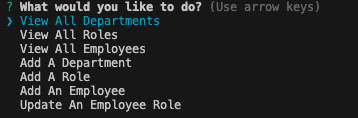
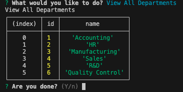
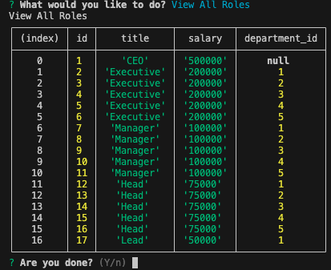
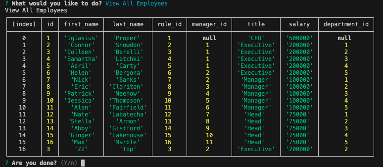

# SQL-Employee-Tracker

## Table of Contents

[Description](#description)
<br>
[Technologies Used](#technologies-used)
<br>
[Installation](#installation)
<br>
[Usage](#usage)
<br>
[Credits](#credits)

## Description

The purpose of the application is to allow business owners to view and manage departments, roles, and employees in their company so that they can orgnaize and plan their business.

The following video demonstrates the applications functionality: [SQL Tracker](https://drive.google.com/file/d/1oKzb7uYT5UsHX8cI5J4Sso9u3ILXYtHq/view)

The following screenshots demonstrates the applications functionality: 
<br>
Options Menu:
<br>

<br>
View Departments:
<br>

<br>
View Roles:
<br>

<br>
View Employees:
<br>

<br>

## Technologies Used

* JavaScript
* Node.js
* Inquirer package
* MySQL Database

## Installation

* Install the application by cloning this repository to your local machine.
* Run ```npm i``` to install dependencies needed for this application

## Usage
* Create the employee database by opening terminal running the schema.sql file using command:
```mysql -uroot < db/schema.sql```
* Seed the database by opening terminal running the seeds.sql files using command:
```mysql -uroot < db/seeds.sql```
* Run the application by opening terminal and using command: 
```node index.js```

## Credits

* Application written by Conner Martin aka Conartisttt